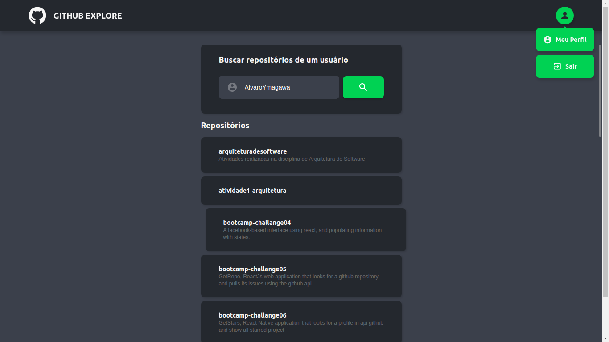
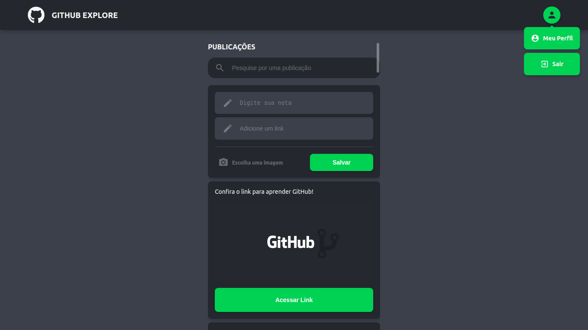

# Git Explore web

## 📖 Table content
- [About](#about)
- [Screens](#screens)
- [Technologies](#technologies)
- [How to install](#how-to-install)

## 💻 About
This is a React.js study project for college.

## 📱 Pages





## ⚒️ Technologies
- [Redux](https://redux.js.org//)
- [React](https://pt-br.reactjs.org/)
- [Javascript](https://devdocs.io/javascript/)

## ⚙️ How to install
```bash
# Install dependencies
$ yarn

# Run local server
$ yarn start
```
